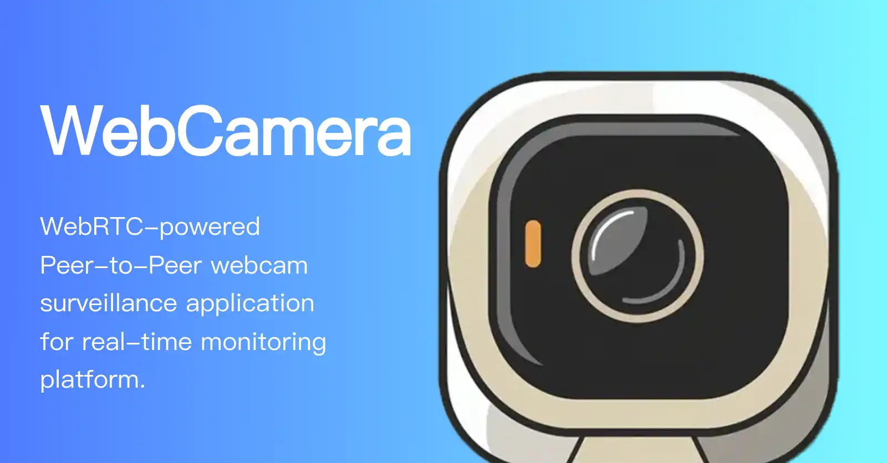

# WebCamera




WebCamera 是一个基于 WebRTC 技术的网络摄像头工具站，使用 Nuxt.js 框架开发，并通过 Yarn 进行包管理。

## 目录

- [特性](#特性)
- [安装](#安装)
- [使用](#使用)
- [构建](#构建)
- [贡献](#贡献)
- [许可证](#许可证)

## 特性

- **实时视频流**: 使用 WebRTC 技术实现高效的实时视频流。
- **跨平台支持**: 兼容多种浏览器和设备。
- **易于开发**: 基于 Nuxt.js 框架，方便扩展和维护。
- **模块化设计**: 便于功能的扩展和集成。
- **隐私安全**: 使用点对点加密连接，保护隐私安全。

## 安装

在开始之前，请确保您的系统已经安装了 [Node.js](https://nodejs.org/) 和 [Yarn](https://yarnpkg.com/)。

1. 克隆仓库

```bash
git clone https://github.com/ShouChenICU/WebCamera.git

cd WebCamera
```

2. 安装依赖

```bash
yarn install
```

## 使用

1. 启动开发服务器

```bash
yarn run dev
```

2. 打开浏览器访问 `http://localhost:3000`

## 构建

1. 进入项目根目录执行

```bash
yarn run build
```

2. 构建输出在 `.output` 目录中
3. 进入 `.output` 执行如下命令即可启动服务

```bash
node server/index.mjs
```

## 贡献

我们欢迎任何形式的贡献！如果你有任何建议或发现了 bug，请提交一个 issue 或者发送一个 pull request。

1. Fork 本仓库
2. 创建一个新的分支 (`git checkout -b feature-branch`)
3. 提交你的更改 (`git commit -am 'Add some feature'`)
4. 推送到分支 (`git push origin feature-branch`)
5. 创建一个新的 Pull Request

## 许可证

该项目基于 MIT 许可证，详细信息请参阅 [LICENSE](./LICENSE) 文件。
